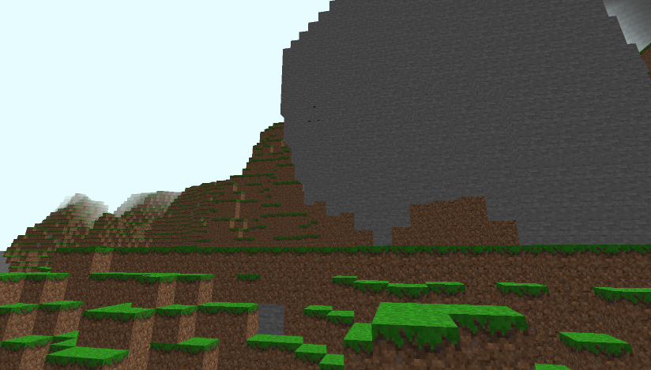
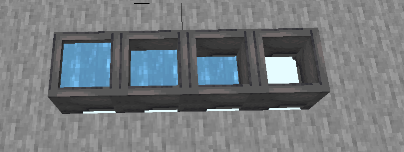
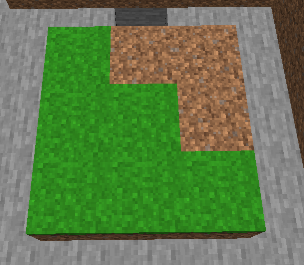

# Paulcraft

A clone of Minecraft that runs in the browser. **[Play it now!](https://paulvonallwoerden.github.io/paulcraft/dist/index.html)**

## Details

### Features

* Infinite world
* Place & break blocks
* Biomes
* Caves & Cliffs
* Block models (e.g. non-cubic blocks)
* Block states (e.g. door open/closed)
* Block ticks (e.g. growing plants)
* Player controller with block collisions
* Sounds & Music

### Planned features

* Structures (e.g. Trees)
* Saving
* Items
* Inventory
* UI
* Entities (e.g. Pigs, Sheep)
* Lighting

### Known bugs

* Using another browser tab will cause the player to fall through the terrain
* Chunk rendering order is not prioritized on player location

## Impressions






## Usage

```sh
# Install dependencies
yarn

# Run game
yarn serve
```

## Credits

### Sounds

  * [Place block](https://freesound.org/people/greenvwbeetle/sounds/244653/)
  * [Break block](https://freesound.org/people/MorneDelport/sounds/326407/)
  * [Open/close door](https://freesound.org/people/InspectorJ/sounds/339677/)

### Music

  * [Shimmer by airtone](http://dig.ccmixter.org/files/airtone/64622)

### Textures

  * [Faithful 32x32](https://resourcepack.net/faithful-32x32-resource-pack/)
  * [Clafault by Rikox3](https://resource-packs.de/clafault/)
