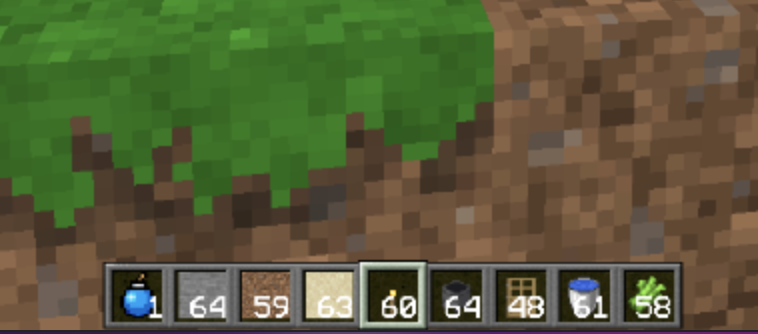

# paulcraft

A clone of Minecraft that runs in the browser. **[Play it now!](https://paulvonallwoerden.github.io/paulcraft/dist/index.html)**

## Details

### Controls

* Move: `W, A, S, D`
* Jump: `Space`
* Break Block: `Left Mouse Button`
* Place Block: `Right Mouse Button`
* Select Block to place:
  * Next: `E`
  * Previous: `Q`
* Enable Fly: `F`
  * Fly down: `Left-Shift`
* Disable collision: `N`

> For more technical controls look at [player.ts](src/player/player.ts).

### Features

* Infinite world
* Place & break blocks
* Biomes
* Caves & Cliffs
* Block models (e.g. non-cubic blocks)
* Block states (e.g. door open/closed)
* Block ticks (e.g. growing plants)
* Player controller with block collisions
* Sounds & Music
* Lighting
* Structures (e.g. Trees)
* Day/Night cycle

### Planned features

* Saving
* Items
* Inventory
* UI
* Entities (e.g. Pigs, Sheep)
* Finer player/world collisions

### Known bugs

* Using another browser tab will cause the player to fall through the terrain
* Visible chunk borders for lighting & tree generation

## Impressions





## Usage

```sh
# Install dependencies
yarn

# Run game
yarn serve
```

## Credits

### Sounds

  * [Break block](https://freesound.org/people/MorneDelport/sounds/326407/)
  * [Explosion](https://freesound.org/people/derplayer/sounds/587194/)
  * [Open/close door](https://freesound.org/people/InspectorJ/sounds/339677/)
  * [Place block](https://freesound.org/people/greenvwbeetle/sounds/244653/)

### Music

  * [Shimmer by airtone](http://dig.ccmixter.org/files/airtone/64622)

### Textures

  * [Clafault by Rikox3](https://resource-packs.de/clafault/)
  * [Faithful 32x32](https://resourcepack.net/faithful-32x32-resource-pack/)
